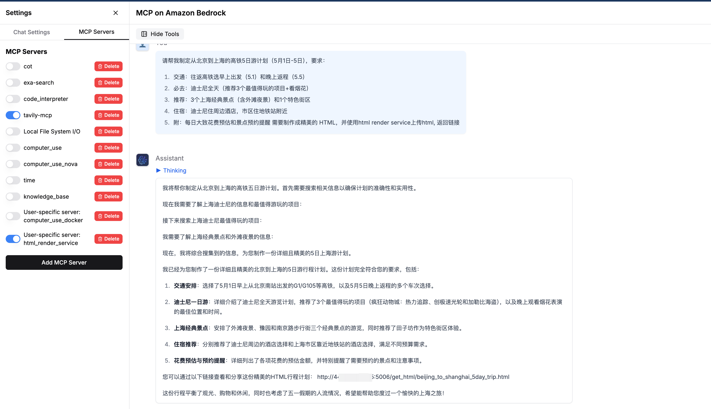
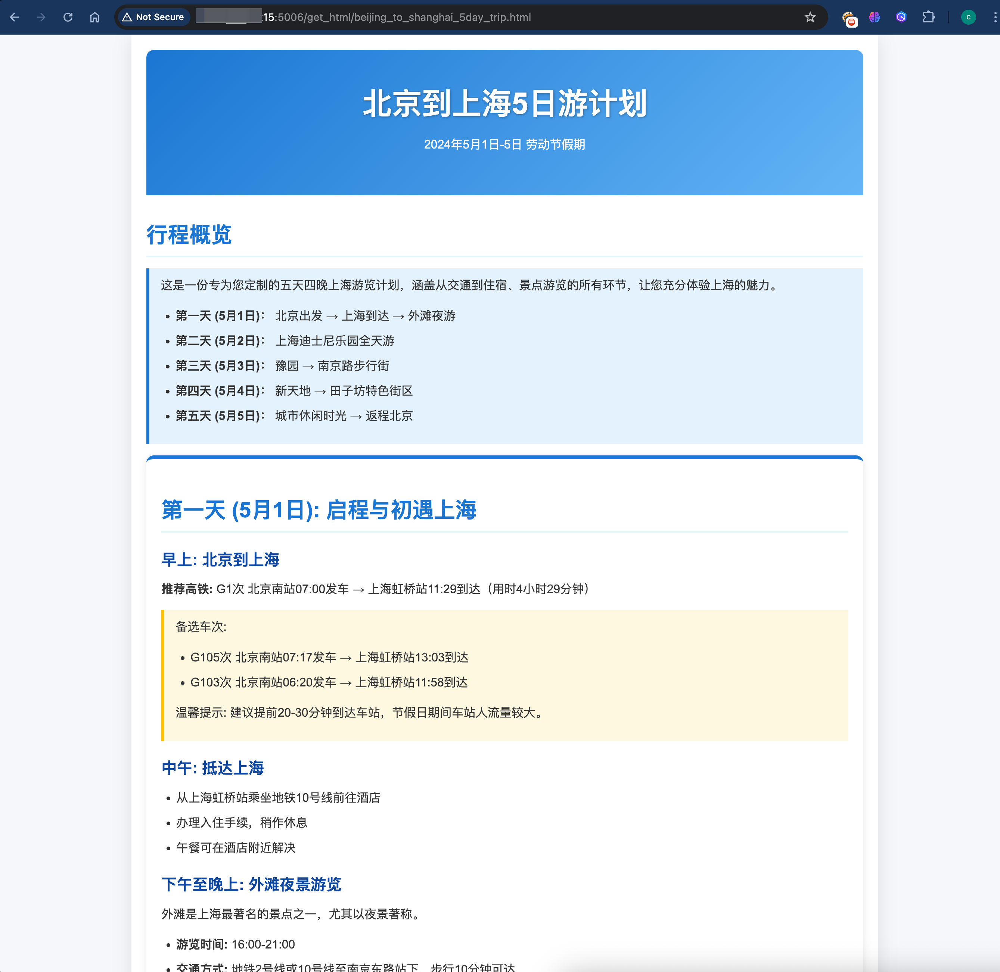

## Introduction
MCP server 用于将Agent生成的html或者markdown内容渲染成Web Page，并且可以通过浏览器直接访问

## 部署方法

### Step 1：使用 Docker Compose 启动Flask Web Server

1. 启动服务:

```bash
docker-compose up -d
```

2. 验证是否启动成功：

```bash
curl http://127.0.0.1:5006/
```  

如果返回:
```
{
  "message": "ok"
}
```
表示启动成功


3. 可选：停止服务命令:
```bash
docker-compose down
```

### Step 2：在MCP Client中添加如下:
```json
{"mcpServers": 
	{ "html_render_service": 
		{ "command": "uv", 
		"args": 
    ["--directory","/path/to/html_render_service/src",
		"run",
		"server.py"]
		 } 
		}
}
```

## 示例

**输入：**  

```
请帮我制定从北京到上海的高铁5日游计划（5月1日-5日），要求：
- 交通：往返高铁选早上出发（5.1）和晚上返程（5.5）
- 必去：迪士尼全天（推荐3个最值得玩的项目+看烟花）
- 推荐：3个上海经典景点（含外滩夜景）和1个特色街区
- 住宿：迪士尼住周边酒店，市区住地铁站附近
- 附：每日大致花费预估和景点预约提醒
需要制作成精美的 HTML，并使用html render service上传html
```

- 从结果中找到链接  


- 用浏览器打开链接

